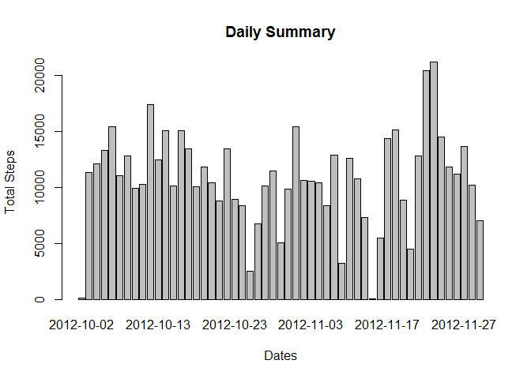
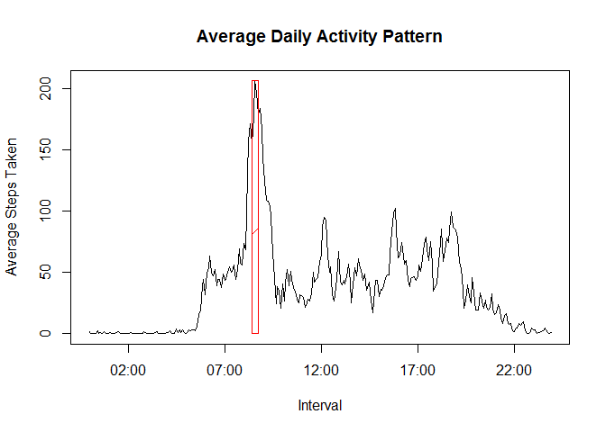

# Reproducible Research: Peer Assessment 1

## Loading and preprocessing the data


```r
# Load all the libraries used in this assignment
library(data.table)
library(dplyr)
```

```
## 
## Attaching package: 'dplyr'
## 
## The following objects are masked from 'package:data.table':
## 
##     between, last
## 
## The following object is masked from 'package:stats':
## 
##     filter
## 
## The following objects are masked from 'package:base':
## 
##     intersect, setdiff, setequal, union
```

```r
library(lubridate)
```

```
## 
## Attaching package: 'lubridate'
## 
## The following objects are masked from 'package:data.table':
## 
##     hour, mday, month, quarter, wday, week, yday, year
```

```r
library(xtable)
library(lattice)

file <- "../data/repdata_data_activity/activity.csv"
dt_total <- fread(file, header=TRUE, stringsAsFactors=FALSE, colClasses=c("integer","character","integer"))

# Tidy the data into a format usable for the rest of this assigment
dt_clean <- dt_total

dt_clean$Interval <- fast_strptime(
    sprintf("%d:%d", dt_total$interval %/% 100, dt_total$interval %% 100), 
    "%H:%M", tz="UTC")        # Create a new field Interval as a Time Series

dt_clean$interval <- sprintf("%04d", dt_clean$interval)     # Convert Interval into HHMM format

dt_activity <- dt_clean[complete.cases(dt_clean), ]         # Handle only complete cases
```

## What is mean total number of steps taken per day?

```r
# Aggregating the steps taken for each day
dt_daily_summary <- dt_activity %>% group_by(date) %>% summarise(daily_total_steps = sum(steps), 
                                             daily_average_steps = mean(steps))
```
<!-- html table generated in R 3.1.2 by xtable 1.7-4 package -->
<!-- Tue Mar 10 19:05:16 2015 -->
<table border=1>
<caption align="bottom"> Daily Summary </caption>
<tr> <th>  </th> <th> date </th> <th> daily_total_steps </th> <th> daily_average_steps </th>  </tr>
  <tr> <td align="right"> 1 </td> <td> 2012-10-02 </td> <td align="right"> 126 </td> <td align="right"> 0.44 </td> </tr>
  <tr> <td align="right"> 2 </td> <td> 2012-10-03 </td> <td align="right"> 11352 </td> <td align="right"> 39.42 </td> </tr>
  <tr> <td align="right"> 3 </td> <td> 2012-10-04 </td> <td align="right"> 12116 </td> <td align="right"> 42.07 </td> </tr>
  <tr> <td align="right"> 4 </td> <td> 2012-10-05 </td> <td align="right"> 13294 </td> <td align="right"> 46.16 </td> </tr>
  <tr> <td align="right"> 5 </td> <td> 2012-10-06 </td> <td align="right"> 15420 </td> <td align="right"> 53.54 </td> </tr>
  <tr> <td align="right"> 6 </td> <td> 2012-10-07 </td> <td align="right"> 11015 </td> <td align="right"> 38.25 </td> </tr>
  <tr> <td align="right"> 7 </td> <td> 2012-10-09 </td> <td align="right"> 12811 </td> <td align="right"> 44.48 </td> </tr>
  <tr> <td align="right"> 8 </td> <td> 2012-10-10 </td> <td align="right"> 9900 </td> <td align="right"> 34.38 </td> </tr>
  <tr> <td align="right"> 9 </td> <td> 2012-10-11 </td> <td align="right"> 10304 </td> <td align="right"> 35.78 </td> </tr>
  <tr> <td align="right"> 10 </td> <td> 2012-10-12 </td> <td align="right"> 17382 </td> <td align="right"> 60.35 </td> </tr>
  <tr> <td align="right"> 11 </td> <td> 2012-10-13 </td> <td align="right"> 12426 </td> <td align="right"> 43.15 </td> </tr>
  <tr> <td align="right"> 12 </td> <td> 2012-10-14 </td> <td align="right"> 15098 </td> <td align="right"> 52.42 </td> </tr>
  <tr> <td align="right"> 13 </td> <td> 2012-10-15 </td> <td align="right"> 10139 </td> <td align="right"> 35.20 </td> </tr>
  <tr> <td align="right"> 14 </td> <td> 2012-10-16 </td> <td align="right"> 15084 </td> <td align="right"> 52.38 </td> </tr>
  <tr> <td align="right"> 15 </td> <td> 2012-10-17 </td> <td align="right"> 13452 </td> <td align="right"> 46.71 </td> </tr>
  <tr> <td align="right"> 16 </td> <td> 2012-10-18 </td> <td align="right"> 10056 </td> <td align="right"> 34.92 </td> </tr>
  <tr> <td align="right"> 17 </td> <td> 2012-10-19 </td> <td align="right"> 11829 </td> <td align="right"> 41.07 </td> </tr>
  <tr> <td align="right"> 18 </td> <td> 2012-10-20 </td> <td align="right"> 10395 </td> <td align="right"> 36.09 </td> </tr>
  <tr> <td align="right"> 19 </td> <td> 2012-10-21 </td> <td align="right"> 8821 </td> <td align="right"> 30.63 </td> </tr>
  <tr> <td align="right"> 20 </td> <td> 2012-10-22 </td> <td align="right"> 13460 </td> <td align="right"> 46.74 </td> </tr>
  <tr> <td align="right"> 21 </td> <td> 2012-10-23 </td> <td align="right"> 8918 </td> <td align="right"> 30.97 </td> </tr>
  <tr> <td align="right"> 22 </td> <td> 2012-10-24 </td> <td align="right"> 8355 </td> <td align="right"> 29.01 </td> </tr>
  <tr> <td align="right"> 23 </td> <td> 2012-10-25 </td> <td align="right"> 2492 </td> <td align="right"> 8.65 </td> </tr>
  <tr> <td align="right"> 24 </td> <td> 2012-10-26 </td> <td align="right"> 6778 </td> <td align="right"> 23.53 </td> </tr>
  <tr> <td align="right"> 25 </td> <td> 2012-10-27 </td> <td align="right"> 10119 </td> <td align="right"> 35.14 </td> </tr>
  <tr> <td align="right"> 26 </td> <td> 2012-10-28 </td> <td align="right"> 11458 </td> <td align="right"> 39.78 </td> </tr>
  <tr> <td align="right"> 27 </td> <td> 2012-10-29 </td> <td align="right"> 5018 </td> <td align="right"> 17.42 </td> </tr>
  <tr> <td align="right"> 28 </td> <td> 2012-10-30 </td> <td align="right"> 9819 </td> <td align="right"> 34.09 </td> </tr>
  <tr> <td align="right"> 29 </td> <td> 2012-10-31 </td> <td align="right"> 15414 </td> <td align="right"> 53.52 </td> </tr>
  <tr> <td align="right"> 30 </td> <td> 2012-11-02 </td> <td align="right"> 10600 </td> <td align="right"> 36.81 </td> </tr>
  <tr> <td align="right"> 31 </td> <td> 2012-11-03 </td> <td align="right"> 10571 </td> <td align="right"> 36.70 </td> </tr>
  <tr> <td align="right"> 32 </td> <td> 2012-11-05 </td> <td align="right"> 10439 </td> <td align="right"> 36.25 </td> </tr>
  <tr> <td align="right"> 33 </td> <td> 2012-11-06 </td> <td align="right"> 8334 </td> <td align="right"> 28.94 </td> </tr>
  <tr> <td align="right"> 34 </td> <td> 2012-11-07 </td> <td align="right"> 12883 </td> <td align="right"> 44.73 </td> </tr>
  <tr> <td align="right"> 35 </td> <td> 2012-11-08 </td> <td align="right"> 3219 </td> <td align="right"> 11.18 </td> </tr>
  <tr> <td align="right"> 36 </td> <td> 2012-11-11 </td> <td align="right"> 12608 </td> <td align="right"> 43.78 </td> </tr>
  <tr> <td align="right"> 37 </td> <td> 2012-11-12 </td> <td align="right"> 10765 </td> <td align="right"> 37.38 </td> </tr>
  <tr> <td align="right"> 38 </td> <td> 2012-11-13 </td> <td align="right"> 7336 </td> <td align="right"> 25.47 </td> </tr>
  <tr> <td align="right"> 39 </td> <td> 2012-11-15 </td> <td align="right">  41 </td> <td align="right"> 0.14 </td> </tr>
  <tr> <td align="right"> 40 </td> <td> 2012-11-16 </td> <td align="right"> 5441 </td> <td align="right"> 18.89 </td> </tr>
  <tr> <td align="right"> 41 </td> <td> 2012-11-17 </td> <td align="right"> 14339 </td> <td align="right"> 49.79 </td> </tr>
  <tr> <td align="right"> 42 </td> <td> 2012-11-18 </td> <td align="right"> 15110 </td> <td align="right"> 52.47 </td> </tr>
  <tr> <td align="right"> 43 </td> <td> 2012-11-19 </td> <td align="right"> 8841 </td> <td align="right"> 30.70 </td> </tr>
  <tr> <td align="right"> 44 </td> <td> 2012-11-20 </td> <td align="right"> 4472 </td> <td align="right"> 15.53 </td> </tr>
  <tr> <td align="right"> 45 </td> <td> 2012-11-21 </td> <td align="right"> 12787 </td> <td align="right"> 44.40 </td> </tr>
  <tr> <td align="right"> 46 </td> <td> 2012-11-22 </td> <td align="right"> 20427 </td> <td align="right"> 70.93 </td> </tr>
  <tr> <td align="right"> 47 </td> <td> 2012-11-23 </td> <td align="right"> 21194 </td> <td align="right"> 73.59 </td> </tr>
  <tr> <td align="right"> 48 </td> <td> 2012-11-24 </td> <td align="right"> 14478 </td> <td align="right"> 50.27 </td> </tr>
  <tr> <td align="right"> 49 </td> <td> 2012-11-25 </td> <td align="right"> 11834 </td> <td align="right"> 41.09 </td> </tr>
  <tr> <td align="right"> 50 </td> <td> 2012-11-26 </td> <td align="right"> 11162 </td> <td align="right"> 38.76 </td> </tr>
  <tr> <td align="right"> 51 </td> <td> 2012-11-27 </td> <td align="right"> 13646 </td> <td align="right"> 47.38 </td> </tr>
  <tr> <td align="right"> 52 </td> <td> 2012-11-28 </td> <td align="right"> 10183 </td> <td align="right"> 35.36 </td> </tr>
  <tr> <td align="right"> 53 </td> <td> 2012-11-29 </td> <td align="right"> 7047 </td> <td align="right"> 24.47 </td> </tr>
   </table>

### Plotting the daily total along the dates

```r
barplot(dt_daily_summary$daily_total_steps, names=dt_daily_summary$date, 
        xlab="Dates", ylab="Total Steps", main="Daily Summary")
```

 

### The overall average number of steps taken over the period

```r
mean(dt_daily_summary$daily_total_steps)
```

```
## [1] 10766.19
```

### The overall median of steps taken over the same period

```r
median(dt_daily_summary$daily_total_steps)
```

```
## [1] 10765
```

## What is the average daily activity pattern?

```r
# Aggregating the steps taken for each interval to see daily activity patterns
dt_daily_activity <- dt_activity %>% group_by(Interval) %>% 
    summarise(interval_total_steps = sum(steps), 
              interval_average_steps = mean(steps))

# Plotting the Average Number of Steps Taken by each Interval
plot(dt_daily_activity$Interval, dt_daily_activity$interval_average_steps,
     type="l", xlab="Interval", ylab="Average Steps Taken", 
     main="Average Daily Activity Pattern")
```

 

## Imputing missing values


```r
# The total number of rows with missing steps information
nrow(dt_clean[is.na(dt_clean$steps), ])
```

```
## [1] 2304
```

```r
# Copy dt_clean into a new data.frame for data input
df_clean <- as.data.frame(dt_clean)

# Strategy: Replace all NA values with the mean steps for the same interval
# 
# Method:
# Extract subset of NA steps from df_clean, match it's Interval to that of
# dt_daily_activity (created above) and retrieve it's average steps
df_clean[is.na(df_clean$steps),]$steps <-
    dt_daily_activity[match(df_clean[is.na(df_clean$steps),]$Interval,
                            dt_daily_activity$Interval), ]$interval_average_steps

# Aggregating the steps taken for each day
df_new_daily_summary <- df_clean %>% group_by(date) %>% 
    summarise(daily_total_steps = sum(steps),
              daily_average_steps = mean(steps))

# Set proper names for each column
barplot(df_new_daily_summary$daily_total_steps, names=df_new_daily_summary$date, 
        xlab="Dates", ylab="Total Steps", main="Daily Summary with Adjustments")
```

 

```r
mean(df_new_daily_summary$daily_total_steps)
```

```
## [1] 10766.19
```

```r
median(df_new_daily_summary$daily_total_steps)
```

```
## [1] 10766.19
```
## Are there differences in activity patterns between weekdays and weekends?


```r
# Create a new column "dayofweek" with the day of week using the weekdays() function
df_clean$dayofweek <- weekdays(ymd(df_clean$date))

# Create a new column "wday"" as a factor of weekend or weekday based on the 
# dayofweek.  I could use the column created earlier but the following uses
# the data source itself.
df_clean$wday <- as.factor(ifelse(weekdays(ymd(df_clean$date)) %in% 
                                      c("Saturday", "Sunday"), 
                                  "Weekend", "Weekday"))

# Using dplyr to obtain the group averages between weekends and weekdays and place the
# set into a new variable df_daily_activity

df_daily_activity <- df_clean %>% group_by(wday, Interval) %>% 
    summarise(interval_total_steps = sum(steps), 
              interval_average_steps = mean(steps))

# Using Lattice graphics to perform the plot
time_series = seq(df_daily_activity$Interval[25], df_daily_activity$Interval[288], by = "5 hours")

xyplot(interval_average_steps ~ Interval | wday, 
       data=df_daily_activity, type="l", layout=c(1,2), xlab="Intervals", 
       ylab="Average Steps Taken",
       main="Average Daily Pattern",
       scales = list(x=list(at=time_series, 
                            labels=format(time_series, "%H:%M")))
)
```

 

Another way of looking at the comparisons between the daily activities is to use an overlaid plot.


```r
# Plotting the Average Number of Steps Taken by each Interval for weekdays
plot(df_daily_activity[df_daily_activity$wday == "Weekday", ]$Interval, 
     df_daily_activity[df_daily_activity$wday == "Weekday", ]$interval_average_steps,
     type="l", xlab="Interval", ylab="Average Steps Taken", 
     main="Average Daily Activity Pattern", col="red")

weekday_mean <- 
    mean(df_daily_activity[df_daily_activity$wday == "Weekday", ]$interval_average_steps)

abline(h=weekday_mean, col="red")

# Adding the Average Number of Steps Taken by each Interval for weekends
lines(df_daily_activity[df_daily_activity$wday == "Weekend", ]$Interval, 
     df_daily_activity[df_daily_activity$wday == "Weekend", ]$interval_average_steps,
     type="l", xlab="Interval", ylab="Average Steps Taken", 
     main="Average Daily Activity Pattern", col="blue")

weekend_mean <- 
    mean(df_daily_activity[df_daily_activity$wday == "Weekend", ]$interval_average_steps)

abline(h=weekend_mean, col="blue")

legend("topright", c("Weekday", "Weekend"), 
       col=c("red", "blue"), lwd=2, cex=0.8)
```

 
  
### Observations
1.  There are low activities in earlier interval periods for both Weekdays and Weekends until around 6 am.  
2.  Activities pick up after that but different for Weekdays and Weekends, where there is higher level of steps taken for Weekdays until before noon.  
3.  Activities generally lowers just after 11am and before 12 noon but tend to stay higher for Weekends than Weekdays for the rest of the day.  
4.  In comparison, the average level of activities (based on steps taken) is higher on Weekend than on Weekdays - as seen by the two horizontal lines.
5.  For both Weekdays and Weekends, activities are reduced significantly after 10pm.  
